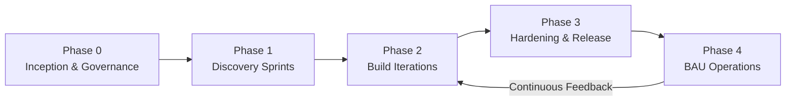
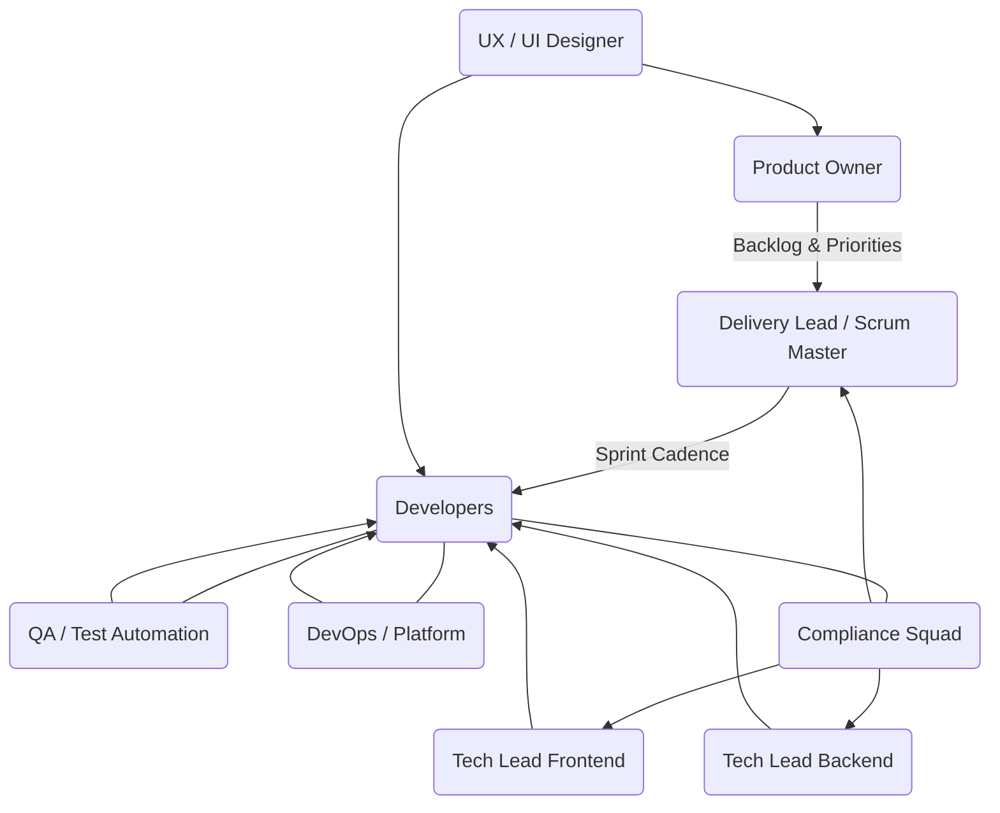
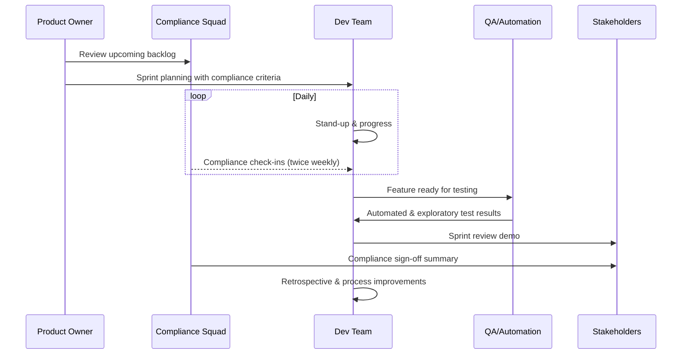
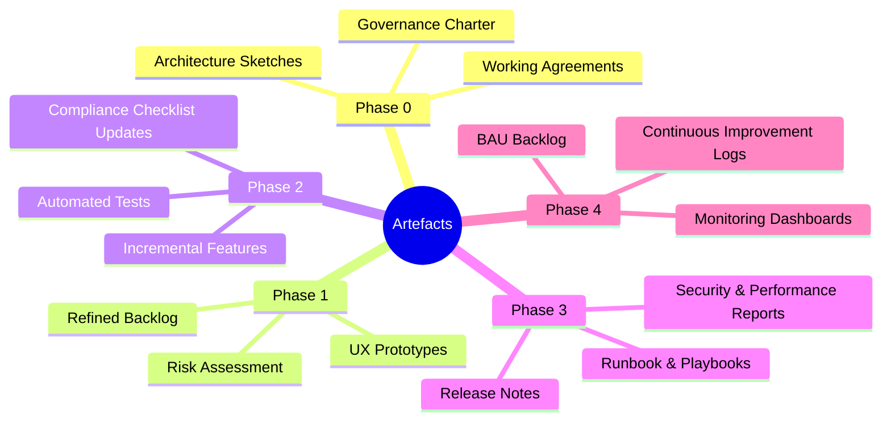

# Delivery Framework – Developer- New Project and Centred BAU after release with Compliance Squad

This document captures the operating model for new-project delivery within a BAU cadence. It balances developer autonomy, stakeholder transparency, and embedded compliance.

## 1. Phased Delivery Overview

**Highlights**
- Each phase ends with tangible artefacts (architecture pack, refined backlog, release candidate, runbook).
- Feedback loops ensure we iterate quickly without sacrificing compliance.

## 2. Squad Composition & Responsibilities

**Operating Notes**
- Compliance squad participates in planning, reviews, and definition-of-done checks.
- Tech leads provide architectural guidance while developers own implementation decisions.

## 3. Iteration Workflow

**Key Practices**
- Definition of Done includes automated tests, security scan, compliance checklist.
- Compliance updates are lightweight but frequent—no surprises at release.

## 4. Artefacts & Tooling per Phase

**Tooling Suggestions**
- Jira for backlog/epics, including compliance tasks.
- GitHub/GitLab (CI pipelines, code reviews).
- Terraform for IaC, SonarQube/Snyk for quality/security, Cypress/Playwright for e2e.

## 5. Adoption Checklist

- [ ] Workshop to confirm working agreement and cadence.
- [ ] Embed compliance squad members in sprint rituals (planning, reviews, periodic stand-ups).
- [ ] Codify Definition of Done (tests, docs, compliance checks, pipeline green).
- [ ] Automate quality gates early (linting, unit/integration tests, dependency scans).
- [ ] Maintain shared documentation repo (`.docs/`) for architecture decisions, release notes, and runbooks.
- [ ] Establish BAU backlog grooming and quarterly release planning.

---

**References**
- `.docs/version-2026.01.00-plan.md`
- `.docs/version-2026.01.00-tasks.md`
- `frontend/`, `paia-backend-service/`, `nexus-case-stream/` repositories

